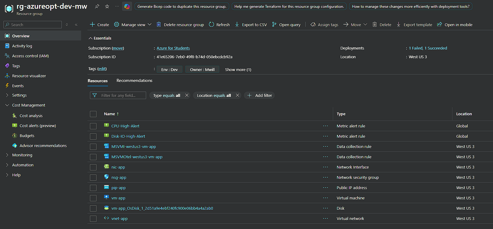
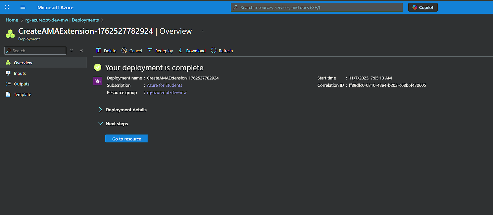
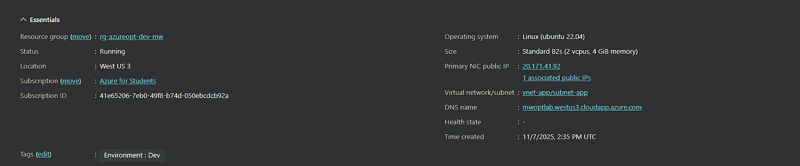
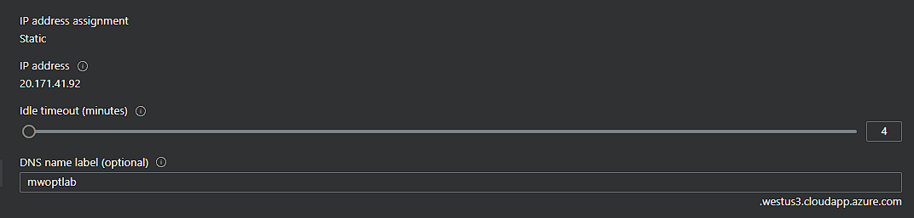
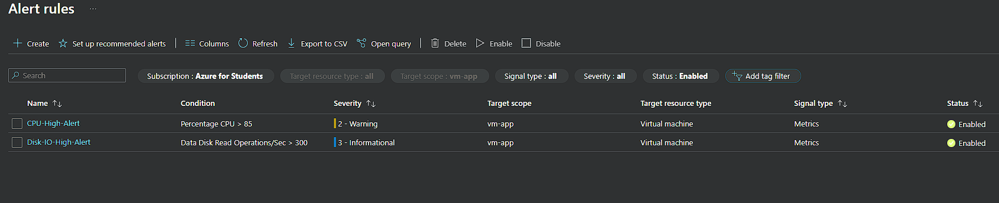
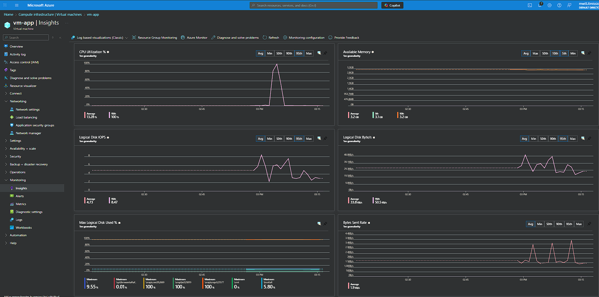
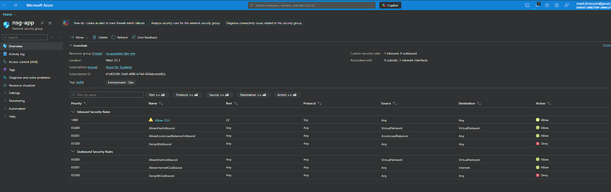

<div align="center">

# ☁️ Azure Resource Optimization Lab

[](https://github.com/mwill20/Azure-Resource-Optimization-Lab/actions/workflows/validate-arm.yml)
[](https://opensource.org/licenses/MIT)
[](https://azure.microsoft.com/)
[](./arm-template/vm-deploy.json)
[](CONTRIBUTING.md)

**End-to-end Azure Resource Optimization Lab** — ARM-based VM deployment with tagging, governance policies, and Azure Monitor alerts. Demonstrates cloud architecture, cost optimization, and observability.

[📖 Documentation](#-key-components) • [🚀 Quick Start](#-quick-start) • [🤝 Contributing](CONTRIBUTING.md)

---

</div>

This project demonstrates end-to-end Azure fundamentals in action — from infrastructure-as-code deployment to cost optimization, governance, and monitoring.  
It was built to simulate the daily work of a Cloud Architect or AI/ML Engineer optimizing real workloads for performance, security, and efficiency.

## 🎯 What This Project Demonstrates
- **Infrastructure-as-Code (IaC):** ARM template automates full Azure VM stack — VNet, Subnet, NSG, NIC, DNS, and Standard Public IP.
- **Optimization & Cost Control:** Uses efficient VM SKUs (B-series), reusable parameters, and tagging for chargeback and resource tracking.
- **Governance:** Introduces Azure Policy concepts to enforce tag compliance and deny oversized SKUs.
- **Monitoring & Observability:** Implements Azure Monitor Insights with alerts for CPU and Disk I/O to demonstrate proactive performance management.
- **Real-World Thinking:** Reflects production practices — tag hygiene, region-aware deployment, DNS naming, quota troubleshooting, and operational visibility.

---

## 🧱 Architecture Overview

```
Client ↔ Public IP (DNS) → NIC → NSG → Subnet → VNet → Ubuntu VM
                                                            ↓
                                                 Azure Monitor (metrics + logs)
```

---

## 🧩 Key Components
| Layer | Azure Service | Purpose |
|-------|----------------|----------|
| Compute | Virtual Machine (Ubuntu 22.04) | Core workload simulation |
| Network | VNet, Subnet, NSG, Public IP | Secure connectivity |
| Governance | Tags, Azure Policy (require tag / deny G-Series) | Compliance & cost tracking |
| Monitoring | Azure Monitor, VM Insights | Metric collection & alerting |
| Automation | ARM Template | Repeatable, parameterized deployment |

---

## 🚀 Quick Start

### Deploy (Azure Portal)

1. Create a Resource Group with tags: `Environment=Dev`, `Owner=<YourName>`, `Project=azure-opt-lab`
2. **Deploy a custom template** → paste `arm-template/vm-deploy.json`
3. Configure parameters: `adminUsername=azureuser`, strong password, unique `dnsLabelPrefix`, `vmSize=Standard_B2s`
4. After deployment, verify DNS label on the Public IP

> 📘 **Detailed Instructions**: See [DEPLOYMENT.md](DEPLOYMENT.md) for complete step-by-step guides using Portal, Azure CLI, or PowerShell.

> ⚠️ **Note**: On "Azure for Students", Basic Public IPs can be blocked. Use **Standard + Static** (template already configured).

### Verify Deployment

- VM Overview shows DNS like `mwoptlab.westus3.cloudapp.azure.com`
- SSH connection: `ssh azureuser@<dns-name>`

### Monitoring Setup

See [`monitoring/alerts.md`](monitoring/alerts.md) for detailed portal configuration:

- **CPU-High-Alert**: Average CPU > 85% for 5 minutes
- **Disk-IO-High-Alert**: Avg Disk Read/Write Ops/Sec > 300 for 5 minutes

---

## 📸 Screenshots

Visual documentation of the deployed infrastructure and monitoring configuration:

### Screenshot 1 — Resource Group Overview


**Purpose:**  
This view verifies successful deployment of all Azure resources created via the ARM template, including VM, VNet, NSG, NIC, Public IP, and monitoring artifacts. It demonstrates organized resource grouping, consistent tagging, and compliance with naming conventions for easy lifecycle management.

### Screenshot 2 — ARM Template Deployment Success


**Purpose:**  
Confirms successful end-to-end Infrastructure-as-Code (IaC) deployment using an Azure Resource Manager template. It validates that the configuration was executed declaratively and that all dependent resources were provisioned automatically and consistently.

### Screenshot 3 — Virtual Machine Overview


**Purpose:**  
Provides evidence that the virtual machine vm-app is operational with a valid DNS name and public IP, proving external accessibility. Shows correct configuration of size, OS (Ubuntu 22.04), region, and tagging — confirming a properly parameterized deployment.

### Screenshot 4 — Public IP Configuration


**Purpose:**  
Demonstrates correct public IP resource configuration with static allocation, Standard SKU, and custom DNS label (mwoptlab.westus3.cloudapp.azure.com). This verifies production-grade networking settings for stability, reliability, and name-resolution consistency.

### Screenshot 5 — Azure Monitor Alert Rules


**Purpose:**  
Shows proactive operational monitoring through metric-based alert rules. The configuration detects high CPU (> 85%) and high Disk I/O (> 300 Ops/s) conditions, illustrating how cost-efficient VM types can still achieve enterprise-level observability.

### Screenshot 6 — VM Insights Dashboard


**Purpose:**  
Displays real-time telemetry for CPU, memory, and disk utilization gathered via Azure Monitor Agent. The visible performance spikes confirm that monitoring pipelines, data-collection rules, and visualization components are working as intended.

### Screenshot 7 — Network Security Group Rules


**Purpose:**  
This NSG configuration enforces least-privilege access: only SSH (port 22/TCP) is allowed for administrative connectivity, while all other inbound traffic is denied by default. This validates secure perimeter control for the deployed VM and aligns with cloud security best practices.

---

## 🧹 Cleanup

To remove all resources and avoid ongoing charges:

```bash
az group delete -n rg-azureopt-dev-mw --yes --no-wait
```

Or delete via Azure Portal: Resource groups → Select your RG → Delete resource group

---

## 🧠 Learning Outcomes

By completing this lab, I demonstrated the ability to:

1. **Design and deploy infrastructure as code (IaC)** using Azure Resource Manager templates with reusable parameters and variables.  
2. **Implement cost-efficient architecture** by selecting appropriate SKUs, tagging resources for chargeback, and using the Standard Public IP SKU to avoid quota limitations.  
3. **Enforce governance** through Azure Policy definitions that require resource tagging and restrict VM sizes to control cost exposure.  
4. **Establish operational visibility** using Azure Monitor Insights and metric-based alerting for CPU and Disk I/O performance.  
5. **Troubleshoot real-world deployment issues** such as SKU restrictions and quota errors in Azure for Students subscriptions.  
6. **Document, version-control, and publish** a fully repeatable cloud environment suitable for team onboarding or portfolio demonstration.

---

## 🚀 Future Enhancements

Planned improvements for the next iteration:

- **Add Azure Policy automation** via ARM or Bicep to enforce tags and SKU restrictions on deployment.  
- **Integrate Azure Cost Management + Budgets** for automated cost threshold notifications.  
- **Extend monitoring** with Memory and Network alerts using the Azure Monitor Agent (AMA) and KQL.  
- **Add Azure Automation Runbooks** for self-healing or resource cleanup events.  
- **Convert the ARM template to Bicep** for modern syntax and modular structure.  
- **Publish a tutorial video or blog post** showing the full build in real time.

---

## 📂 Repository Structure

```
azure-resource-optimization-lab/
├── arm-template/
│   └── vm-deploy.json          # ARM template (complete stack)
├── monitoring/
│   └── alerts.md               # Azure Monitor alert configurations
├── screenshots/
│   └── *.png                   # Portal screenshots
└── README.md                   # Project documentation (this file)
```

---

## 📜 License

MIT License — free to use for educational and demonstration purposes. See [LICENSE](LICENSE) for details.

---

## 🧩 Author

**Michael Williams**  
Cybersecurity Analyst II | AI/ML & Cloud Engineering Student  
Focused on AI agent security, cloud optimization, and secure infrastructure design.

[](https://www.linkedin.com/in/mwillitmission/)
[](https://github.com/mwill20/)

---


